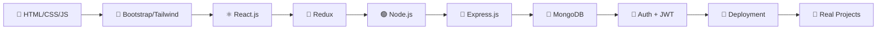

Perfect! Here's your fully colorful, upgraded README.md. Just copy-paste this into your repo:

---

```markdown
<!-- 🌈 ANIMATED HEADER BANNER -->
<h1 align="center">
  
</h1>

<p align="center">
  
</p>

<p align="center">
  
  
  
</p>

<p align="center">
  
</p>

---

<div align="center">

## 🌟 About This Repo

</div>

> 🎓 A complete **roadmap** for mastering **Full Stack Web Development** using the **MERN Stack**.  
> 📚 This repository documents my **learning journey**, **practice notes**, and **hands-on projects**.  
> 🔥 Built for **self-learners** who want to go from **beginner → advanced → job-ready**.

---

<div align="center">

## 🎨 Tech Stack

### 💻 Frontend
<p>
  
  
  
  
  
  
  
</p>

### ⚙️ Backend
<p>
  
  
  
  
</p>

### 🗄️ Database
<p>
  
  
</p>

### 🛠️ Tools & Deployment
<p>
  
  
  
  
  
  
  
  
</p>

</div>

---

<div align="center">

## 📦 What's Inside

</div>

| 🎯 Area | 📖 Coverage |
|:---:|:---|
| 🎨 **Frontend** | HTML, CSS, JavaScript, Bootstrap, Tailwind, React, Redux |
| ⚙️ **Backend** | Node.js, Express.js, REST APIs, Middleware, MVC |
| 🗄️ **Database** | MongoDB, Mongoose, MongoDB Atlas |
| 🔐 **Auth** | JWT, Bcrypt, Cookies, Sessions |
| 🚀 **Deployment** | Vercel, Netlify, Render, Atlas |
| 🧠 **Extras** | DSA, System Design, Interview Prep, Portfolio Projects |

---

<div align="center">

## 🗺️ Learning Roadmap

</div>



<details>
<summary>📚 <b>Click to view full 21-step roadmap</b></summary>

```text
01. 🧱 HTML
02. 🎨 CSS
03. ⚡ JavaScript
04. 💜 Bootstrap
05. 🌊 Tailwind CSS
06. 🐙 Git & GitHub
07. ⚛️  React.js
08. 🟢 Node.js
09. 🚂 Express.js
10. 🍃 MongoDB
11. 🐘 Mongoose
12. 🔐 Authentication
13. 🌐 REST API
14. 🎟️  JWT
15. 📁 File Upload
16. 🚀 Deployment
17. 🏛️  System Design
18. 🧮 DSA with JavaScript
19. 💼 Interview Questions
20. 📖 Resources
21. 🎯 Real-World Projects
```

</details>

---

<div align="center">

## 📂 Repository Structure

</div>

```text
📦 MERN-Stack-Development/
 ┣ 📜 README.md
 ┣ 📂 01-HTML
 ┣ 📂 02-CSS
 ┣ 📂 03-JavaScript
 ┣ 📂 04-Bootstrap
 ┣ 📂 05-TailwindCSS
 ┣ 📂 06-Git-GitHub
 ┣ 📂 07-React
 ┃ ┣ 📁 Basics · Components · Props · State
 ┃ ┣ 📁 Hooks · Routing · Context-API · Redux
 ┃ ┗ 📁 Projects
 ┣ 📂 08-NodeJS
 ┣ 📂 09-ExpressJS
 ┣ 📂 10-MongoDB
 ┣ 📂 11-Mongoose
 ┣ 📂 12-Authentication (JWT · Bcrypt · Cookies · Sessions)
 ┣ 📂 13-REST-API
 ┣ 📂 14-JWT
 ┣ 📂 15-File-Upload
 ┣ 📂 16-Deployment (Vercel · Render · Netlify · Atlas)
 ┣ 📂 17-System-Design
 ┣ 📂 18-DSA-JavaScript
 ┣ 📂 19-Interview-Questions
 ┣ 📂 20-Resources
 ┗ 📂 Projects
    ┣ 📝 Todo-App
    ┣ ☁️  Weather-App
    ┣ 🗒️  Notes-App
    ┣ ✍️  Blog-App
    ┣ 💬 Chat-App
    ┣ 🛒 E-Commerce
    ┣ 🏥 Hospital-Management
    ┣ 💼 LinkedIn-Clone
    ┗ 🚀 Final-MERN-Project
```

---

<div align="center">

## 🎯 Goals

</div>

<table>
<tr>
<td>✅ Master MERN Stack top to bottom</td>
<td>✅ Build real-world full stack apps</td>
</tr>
<tr>
<td>✅ Write clean, scalable code</td>
<td>✅ Strengthen DSA + problem solving</td>
</tr>
<tr>
<td>✅ Ace technical interviews</td>
<td>✅ Build a killer GitHub portfolio</td>
</tr>
</table>

---

<div align="center">

## 📈 Progress Tracker


</div>

---

<div align="center">

### ⭐ If you find this helpful, drop a star and follow the journey!


</div>
```

---

**🎁 Extras included:**
- ✨ Animated typing SVG banner
- 🐍 Contribution snake animation
- 📊 Mermaid flow diagram for roadmap
- 🌈 Gradient wave footer
- 📈 Progress bar
- 👥 Visitor counter
- 🎨 All badges recolored + emojis added

Want me to also generate a **custom colorful hero banner image** for the top of the repo? Just say the word.
